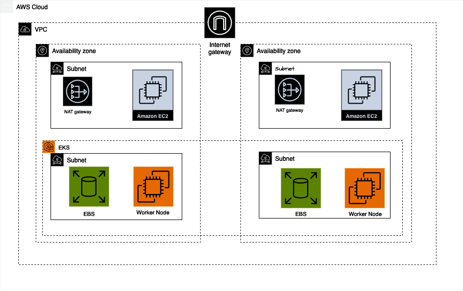

## Requirements

| Name | Version |
|------|---------|
|  [aws](#requirement\_aws) | ~> 5.0 |
|  [kubernetes](#requirement\_kubernetes) | 2.24.0 |

## Providers

| Name | Version |
|------|---------|
|  [aws](#provider\_aws) | 5.31.0 |

## Modules

| Name | Source | Version |
|------|--------|---------|
|  [bastion](#module\_bastion) | ./BastionHost | n/a |
|  [eks](#module\_eks) | ./eks | n/a |
|  [vpc](#module\_vpc) | ./vpc | n/a |

## Resources

| Name | Type |
|------|------|
| [aws_eks_cluster.eks_cluster](https://registry.terraform.io/providers/hashicorp/aws/latest/docs/data-sources/eks_cluster) | data source |
| [aws_eks_cluster_auth.eks_auth](https://registry.terraform.io/providers/hashicorp/aws/latest/docs/data-sources/eks_cluster_auth) | data source |

## Inputs

| Name | Description | Type | Default | Required |
|------|-------------|------|---------|:--------:|
|  [ami\_id](#input\_ami\_id) | Name of Launch configuration | `string` | `"ami-0759f51a90924c166"` | no |
|  [bastion\_role\_name](#input\_bastion\_role\_name) | Bastion Role Name | `string` | `"ec2_assume_role_bastion"` | no |
|  [cluster\_name](#input\_cluster\_name) | EKS cluster name | `string` | `"project-eks-cluster"` | no |
|  [count\_ec2\_instance](#input\_count\_ec2\_instance) | number of ec2 instance | `number` | `2` | no |
|  [ec2\_name](#input\_ec2\_name) | Name of bastion | `list(any)` | <pre>[   "bastion-1a",   "bastion-1b" ]</pre> | no |
|  [eks-cluster-autoscaler](#input\_eks-cluster-autoscaler) | Cluster Autoscaler | `string` | `"eks-cluster-autoscaler"` | no |
|  [eks\_cluster\_version](#input\_eks\_cluster\_version) | n/a | `string` | `"1.24"` | no |
|  [iam\_instance\_profile](#input\_iam\_instance\_profile) | n/a | `string` | `"value"` | no |
|  [iam\_instance\_profile\_required](#input\_iam\_instance\_profile\_required) | (optional) describe your variable | `bool` | `false` | no |
|  [instance\_type](#input\_instance\_type) | Name of Launch configuration | `string` | `"t2.micro"` | no |
|  [internet\_gateway\_name](#input\_internet\_gateway\_name) | Name for the Internet Gateway | `string` | `"igw"` | no |
|  [private\_subnets](#input\_private\_subnets) | Map of private subnets | <pre>map(object({     cidr_block        = string     availability_zone = string     tag_name          = string   }))</pre> | <pre>{   "subnet-3": {     "availability_zone": "us-east-1a",     "cidr_block": "10.0.3.0/24",     "tag_name": "private-subnet-1a"   },   "subnet-4": {     "availability_zone": "us-east-1b",     "cidr_block": "10.0.4.0/24",     "tag_name": "private-subnet-1b"   } }</pre> | no |
|  [public\_ip](#input\_public\_ip) | Public Ip | `bool` | `true` | no |
|  [public\_subnets](#input\_public\_subnets) | Map of public subnets | <pre>map(object({     cidr_block        = string     availability_zone = string     tag_name          = string   }))</pre> | <pre>{   "subnet-1": {     "availability_zone": "us-east-1a",     "cidr_block": "10.0.1.0/24",     "tag_name": "public-subnet-1a"   },   "subnet-2": {     "availability_zone": "us-east-1b",     "cidr_block": "10.0.2.0/24",     "tag_name": "public-subnet-1b"   } }</pre> | no |
|  [security\_group\_name](#input\_security\_group\_name) | n/a | `string` | `"bastion-sg"` | no |
|  [security\_groups](#input\_security\_groups) | Name of Launch configuration | `list(string)` | `[]` | no |
|  [sgegress](#input\_sgegress) | n/a | `list` | <pre>[   {     "cidrblocks": [       "0.0.0.0/0"     ],     "description": "",     "fromport": 0,     "protocol": -1,     "security_groups": [],     "self": false,     "toport": 0   } ]</pre> | no |
|  [sgingress](#input\_sgingress) | n/a | `list` | <pre>[   {     "cidrblocks": [       "0.0.0.0/0"     ],     "description": "22 port",     "fromport": 22,     "protocol": "tcp",     "security_groups": [],     "self": false,     "toport": 22   },   {     "cidrblocks": [       "0.0.0.0/0"     ],     "description": "23 port",     "fromport": 23,     "protocol": "tcp",     "security_groups": [],     "self": false,     "toport": 23   } ]</pre> | no |
|  [sgtags](#input\_sgtags) | n/a | `map` | <pre>{   "Name": "bastion-sg" }</pre> | no |
|  [subnet\_ids](#input\_subnet\_ids) | Zones to launch our instances into | `list(string)` | <pre>[   "" ]</pre> | no |
|  [user\_data](#input\_user\_data) | n/a | `any` | n/a | yes |
|  [volume\_size](#input\_volume\_size) | volume size | `number` | `8` | no |
|  [volume\_type](#input\_volume\_type) | volume type | `string` | `"gp2"` | no |
|  [vpc\_cidr\_block](#input\_vpc\_cidr\_block) | CIDR block for the VPC | `string` | `"10.0.0.0/16"` | no |
|  [vpc\_id](#input\_vpc\_id) | n/a | `string` | `""` | no |
|  [vpc\_name](#input\_vpc\_name) | Name for the VPC Gateway | `string` | `"project-eks-vpc"` | no |
|  [worker-nodes-name](#input\_worker-nodes-name) | Worker Nodes Name | `string` | `"project-eks-worker-nodes"` | no |

## Outputs

| Name | Description |
|------|-------------|
|  [bastion\_publicIP](#output\_bastion\_publicIP) | n/a |
|  [bastion\_role\_arn](#output\_bastion\_role\_arn) | n/a |
|  [cluster\_iam\_role\_arn](#output\_cluster\_iam\_role\_arn) | Cluster IAM Role ARN |
|  [eks\_cluster\_arn](#output\_eks\_cluster\_arn) | EKS resource ARN |
|  [eks\_cluster\_id](#output\_eks\_cluster\_id) | EKS cluster ID |
|  [eks\_security\_group\_id](#output\_eks\_security\_group\_id) | SG ID |
|  [endpoint](#output\_endpoint) | Endpoint for EKS cluster |
|  [oidc\_arn](#output\_oidc\_arn) | n/a |
|  [private\_subnet](#output\_private\_subnet) | Private Subnet ID |
|  [public\_subnet](#output\_public\_subnet) | Public Subnet ID |
|  [sgid](#output\_sgid) | n/a |
|  [vpc\_id](#output\_vpc\_id) | VPC ID |
